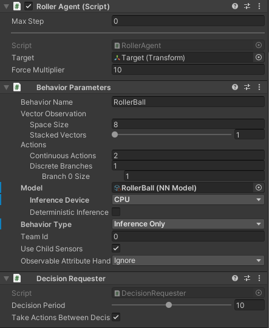
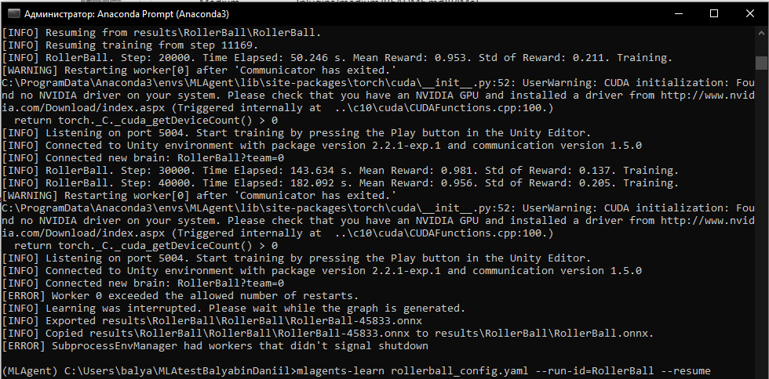

# АНАЛИЗ ДАННЫХ И ИСКУССТВЕННЫЙ ИНТЕЛЛЕКТ [in GameDev]
## Разработка системы машинного обучения.
Отчет по лабораторной работе #3 выполнил:
- Балябин Даниил Сергеевич
- ХИВТ31

Отметка о выполнении заданий:

| Задание | Выполнение | Баллы |
| ------ | ------ | ------ |
| Задание 1 | * | 60 |
| Задание 2 | * | 20 |
| Задание 3 | # | 20 |

знак "*" - задание выполнено; знак "#" - задание не выполнено;

Работу проверили:
- к.т.н., доцент Денисов Д.В.
- к.э.н., доцент Панов М.А.
- ст. преп., Фадеев В.О.

[](https://nodesource.com/products/nsolid)

[](https://travis-ci.org/joemccann/dillinger)


## Цель работы
Познакомиться с программными средствами для создания системы машинного обучения и ее интеграции в Unity.

## Задание 1
### Реализовать систему машинного обучения в связке Python - Google-Sheets – Unity. 
Ход работы:
- Создайте на сцене плоскость, куб и сферу так, как показано на рисунке ниже. Создайте простой C# скрипт-файл и подключите его к сфере.


- В скрипт-файл RollerAgent.cs добавьте код, опубликованный в материалах лабораторных работ.

```py
using System.Collections;
using System.Collections.Generic;
using UnityEngine;
using Unity.MLAgents;
using Unity.MLAgents.Sensors;
using Unity.MLAgents.Actuators;

public class RollerAgent : Agent
{
    Rigidbody rBody;
    // Start is called before the first frame update
    void Start()
    {
        rBody = GetComponent<Rigidbody>();
    }

    public Transform Target;
    public override void OnEpisodeBegin()
    {
        if (this.transform.localPosition.y < 0)
        {
            this.rBody.angularVelocity = Vector3.zero;
            this.rBody.velocity = Vector3.zero;
            this.transform.localPosition = new Vector3(0, 0.5f, 0);
        }

        Target.localPosition = new Vector3(Random.value * 8-4, 0.5f, Random.value * 8-4);
    }
    public override void CollectObservations(VectorSensor sensor)
    {
        sensor.AddObservation(Target.localPosition);
        sensor.AddObservation(this.transform.localPosition);
        sensor.AddObservation(rBody.velocity.x);
        sensor.AddObservation(rBody.velocity.z);
    }
    public float forceMultiplier = 10;
    public override void OnActionReceived(ActionBuffers actionBuffers)
    {
        Vector3 controlSignal = Vector3.zero;
        controlSignal.x = actionBuffers.ContinuousActions[0];
        controlSignal.z = actionBuffers.ContinuousActions[1];
        rBody.AddForce(controlSignal * forceMultiplier);

        float distanceToTarget = Vector3.Distance(this.transform.localPosition, Target.localPosition);

        if(distanceToTarget < 1.42f)
        {
            SetReward(1.0f);
            EndEpisode();
        }
        else if (this.transform.localPosition.y < 0)
        {
            EndEpisode();
        }
    }
}
```


- Объекту «сфера» добавить компоненты Decision Requester, Behavior Parameters и настройте их.



- В корень проекта добавьте файл конфигурации нейронной сети.

```yaml
behaviors:
  RollerBall:
    trainer_type: ppo
    hyperparameters:
      batch_size: 10
      buffer_size: 100
      learning_rate: 3.0e-4
      beta: 5.0e-4
      epsilon: 0.2
      lambd: 0.99
      num_epoch: 3
      learning_rate_schedule: linear
    network_settings:
      normalize: false
      hidden_units: 128
      num_layers: 2
    reward_signals:
      extrinsic:
        gamma: 0.99
        strength: 1.0
    max_steps: 500000
    time_horizon: 64
    summary_freq: 10000
```

- Сделайте 3, 9, 27 копий модели «Плоскость-Сфера-Куб», запустите симуляцию сцены и наблюдайте за результатом обучения модели.



- После завершения обучения проверьте работу модели.

[](https://youtu.be/_kiymhmUpKQ)


- Сделайте выводы.


## Задание 2
### Подробно опишите каждую строку файла конфигурации нейронной сети. Самостоятельно найдите информацию о компонентах Decision Requester, Behavior Parameters, добавленных сфере.

```yaml
behaviors: #cоздание списка "Модель поведения" дял разных агентов
  RollerBall: #cоздание списка конкретного объекта
    trainer_type: ppo #ppo - это алгоритм обучения с подкреплением от OpenAi
    hyperparameters:
      batch_size: 10 #количество опыта на каждоый итерации
      buffer_size: 100 #колличество опыта которое необхдимо собрать для перехода к обучению или изучении модели
      learning_rate: 3.0e-4 #скорость обучения
      beta: 5.0e-4
      epsilon: 0.2
      lambd: 0.99
      num_epoch: 3
      learning_rate_schedule: linear #определение изменения скорости обучения с течением времени
    network_settings:
      normalize: false #к входным данным не применяется нормализация
      hidden_units: 128 #количество нейронов в слоях нейронной сети
      num_layers: 2 #количество слоев нейроной сети
    reward_signals: #настройка сигналов вознаграждения
      extrinsic:
        gamma: 0.99
        strength: 1.0 #коэффициент вознаграждения
    max_steps: 500000 #количество шагов для завершения обучения
    time_horizon: 64 #количество шагов для добавления в буфер опыта
    summary_freq: 10000 #количество шагов для создавния и вывода статистикиобучения
```

- Компонент Decision Requester запрашивает процесс принятия решения для агента через разные временные промежутки, вызывая функцию RequestDecision().

Decision Period - параметр, который определяет частоту, с которой агент запрашивает решение. N - период принятия решеняи. Он означает, что Агент будет запрашивать решение каждые n шагов обучения.


- Behavior Parameters - компонент, который определяет, как именно объект принимает решения.

Behavior Name - имя текущего поведения, которое используется в качестве базового имени и указывается в файле конфигурации модели.

Behavior Type - параметр который определяет, какой тип поведения будет использовать Агент. Default - Агент будет использовать удаленный процесс обучения, запущенный через python для принятия решений. InferenceOnly агент всегда будет использовать предоставленную моделью нейронной сети. HeuristicOnly - всегда используется эвристический метод.

Model - это используемая модель нейронной сети.

InferenceDevice - это выбор между CPU и GPU для предоставленной модели нейронной сети.

Vector Observation - это вектор чисел с плавающей запятой, которые содержат информацию для принятия агентом решений. Вектор заполняется в функции CollectObservations.

Actions - это инструкции в форме действий. Действия делятся на два типа: непрерывные и дискретные.

## Задание 3
### Доработайте сцену и обучите ML-Agent таким образом, чтобы шар перемещался между двумя кубами разного цвета. Кубы должны, как и впервом задании, случайно изменять кооринаты на плоскости. 


## Выводы. Что такое игровой баланс и как системы машинного обучения могут быть использованы для того, чтобы его скорректировать.

Возвращаясь к материалам лекции, я могу сказать что баланс это не просто цифры, таблицы и тп. Это намного большее, чем это. Игровой баланс - стремление разработчиков сделать играбельную и приятную целостную игру для пользователей. Понять есть в игре баланс можно понять через опыт пользователей. Для них будет идеальный игровой баланс только в тот момент, когда уровень сложности и фана будет примерно равным (за исключением целенаправленных на это проектов). Зачастую, очень сложно добится хорошего игрового баланса, но этого также можно достичь применением систем машинного обучения.

Самый простой прмиер - для создания качественного игрового процесса гейм-дизайнеры обычно настраивают баланс игры итеративно:

1. Выполняют нагрузочный тест тысячами плейтестинговых сессий, в которых участвуют тестеры
2. Учитывают их отзывы и изменяют дизайн игры
3. Повторяют этапы 1 и 2, пока результатом не будут довольны и тестеры, и гейм-дизайнеры

Машинное обучение используеться для обучения тех самых плейсетинговых сессий. А уже результаты этих сессий далее применяються в различных этапах и различных составляющих игры.

Это могут быть:
 - Характеристики и показатели игровых персонажей.
 - Дизайн уровня и расположение элементов внутри.
 - Экономика игры, внутриигровые валюты.
 
| Plugin | README |
| ------ | ------ |
| Dropbox | [plugins/dropbox/README.md][PlDb] |
| GitHub | [plugins/github/README.md][PlGh] |
| Google Drive | [plugins/googledrive/README.md][PlGd] |
| OneDrive | [plugins/onedrive/README.md][PlOd] |
| Medium | [plugins/medium/README.md][PlMe] |
| Google Analytics | [plugins/googleanalytics/README.md][PlGa] |

## Powered by

**BigDigital Team: Denisov | Fadeev | Panov**
