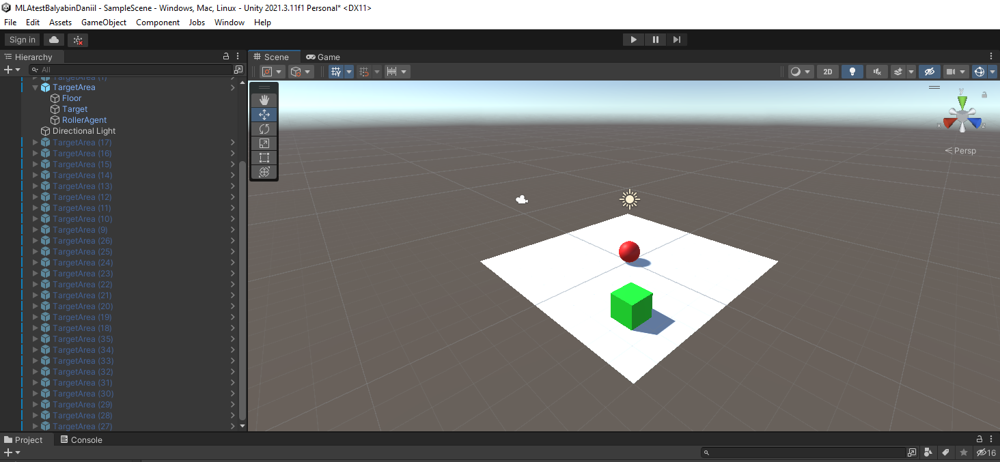

# АНАЛИЗ ДАННЫХ И ИСКУССТВЕННЫЙ ИНТЕЛЛЕКТ [in GameDev]
## Разработка системы машинного обучения.
Отчет по лабораторной работе #3 выполнил:
- Балябин Даниил Сергеевич
- ХИВТ31

Отметка о выполнении заданий:

| Задание | Выполнение | Баллы |
| ------ | ------ | ------ |
| Задание 1 | * | 60 |
| Задание 2 | * | 20 |
| Задание 3 | # | 20 |

знак "*" - задание выполнено; знак "#" - задание не выполнено;

Работу проверили:
- к.т.н., доцент Денисов Д.В.
- к.э.н., доцент Панов М.А.
- ст. преп., Фадеев В.О.

[](https://nodesource.com/products/nsolid)

[](https://travis-ci.org/joemccann/dillinger)


## Цель работы
Познакомиться с программными средствами для создания системы машинного обучения и ее интеграции в Unity.

## Задание 1
### Реализовать систему машинного обучения в связке Python - Google-Sheets – Unity. 
Ход работы:
- Создайте на сцене плоскость, куб и сферу так, как показано на рисунке ниже. Создайте простой C# скрипт-файл и подключите его к сфере.



- В скрипт-файл RollerAgent.cs добавьте код, опубликованный в материалах лабораторных работ.

```py
using System.Collections;
using System.Collections.Generic;
using UnityEngine;
using Unity.MLAgents;
using Unity.MLAgents.Sensors;
using Unity.MLAgents.Actuators;

public class RollerAgent : Agent
{
    Rigidbody rBody;
    // Start is called before the first frame update
    void Start()
    {
        rBody = GetComponent<Rigidbody>();
    }

    public Transform Target;
    public override void OnEpisodeBegin()
    {
        if (this.transform.localPosition.y < 0)
        {
            this.rBody.angularVelocity = Vector3.zero;
            this.rBody.velocity = Vector3.zero;
            this.transform.localPosition = new Vector3(0, 0.5f, 0);
        }

        Target.localPosition = new Vector3(Random.value * 8-4, 0.5f, Random.value * 8-4);
    }
    public override void CollectObservations(VectorSensor sensor)
    {
        sensor.AddObservation(Target.localPosition);
        sensor.AddObservation(this.transform.localPosition);
        sensor.AddObservation(rBody.velocity.x);
        sensor.AddObservation(rBody.velocity.z);
    }
    public float forceMultiplier = 10;
    public override void OnActionReceived(ActionBuffers actionBuffers)
    {
        Vector3 controlSignal = Vector3.zero;
        controlSignal.x = actionBuffers.ContinuousActions[0];
        controlSignal.z = actionBuffers.ContinuousActions[1];
        rBody.AddForce(controlSignal * forceMultiplier);

        float distanceToTarget = Vector3.Distance(this.transform.localPosition, Target.localPosition);

        if(distanceToTarget < 1.42f)
        {
            SetReward(1.0f);
            EndEpisode();
        }
        else if (this.transform.localPosition.y < 0)
        {
            EndEpisode();
        }
    }
}
```


- Объекту «сфера» добавить компоненты Decision Requester, Behavior Parameters и настройте их.


- В корень проекта добавьте файл конфигурации нейронной сети.
[](https://youtu.be/kmwiCT_ul9Q)

- Сделайте 3, 9, 27 копий модели «Плоскость-Сфера-Куб», запустите симуляцию сцены и наблюдайте за результатом обучения модели.

- После завершения обучения проверьте работу модели.


- Сделайте выводы.


## Задание 2
### Подробно опишите каждую строку файла конфигурации нейронной сети. Самостоятельно найдите информацию о компонентах Decision Requester, Behavior Parameters, добавленных сфере.
 


## Задание 3
### Доработайте сцену и обучите ML-Agent таким образом, чтобы шар перемещался между двумя кубами разного цвета. Кубы должны, как и впервом задании, случайно изменять кооринаты на плоскости. 


## Выводы. Что такое игровой баланс и как системы машинного обучения могут быть использованы для того, чтобы его скорректировать.


Мне было довольно тяжело разобраться со связкой Unity + Python + Sheets. Я не успел сделать 2 и 3 задание. Но, как и с прошлой лабораторной работой, я разберусь и доделаю задание (для себя конечно). Считаю проделанную работу с пониманием удовлетворительной. Свою работу с дедлайнами - отвратительной.

| Plugin | README |
| ------ | ------ |
| Dropbox | [plugins/dropbox/README.md][PlDb] |
| GitHub | [plugins/github/README.md][PlGh] |
| Google Drive | [plugins/googledrive/README.md][PlGd] |
| OneDrive | [plugins/onedrive/README.md][PlOd] |
| Medium | [plugins/medium/README.md][PlMe] |
| Google Analytics | [plugins/googleanalytics/README.md][PlGa] |

## Powered by

**BigDigital Team: Denisov | Fadeev | Panov**
